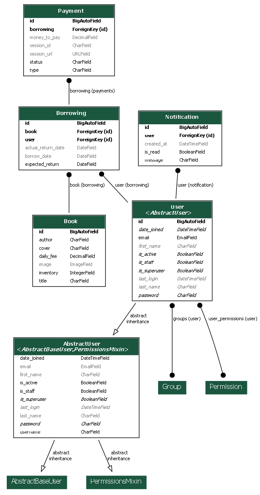
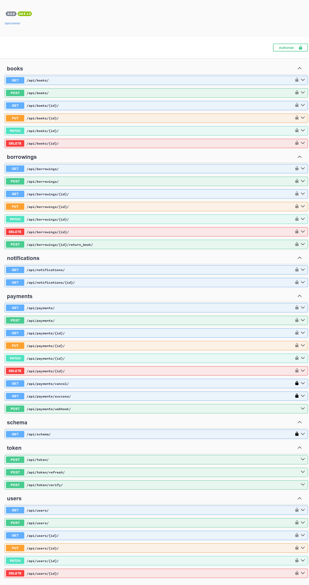
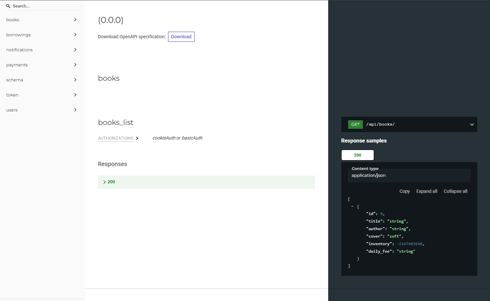
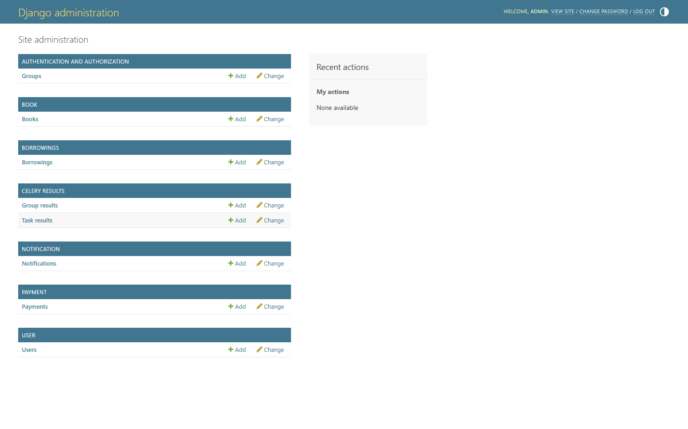
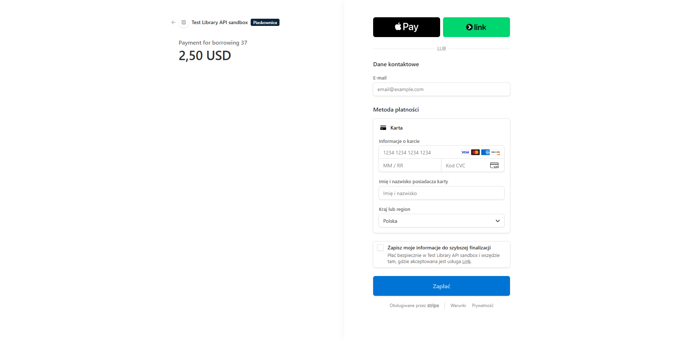
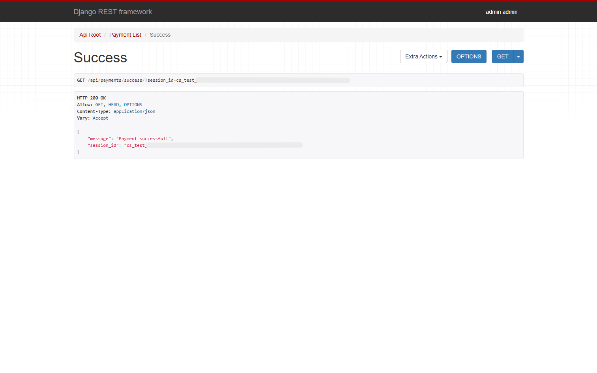
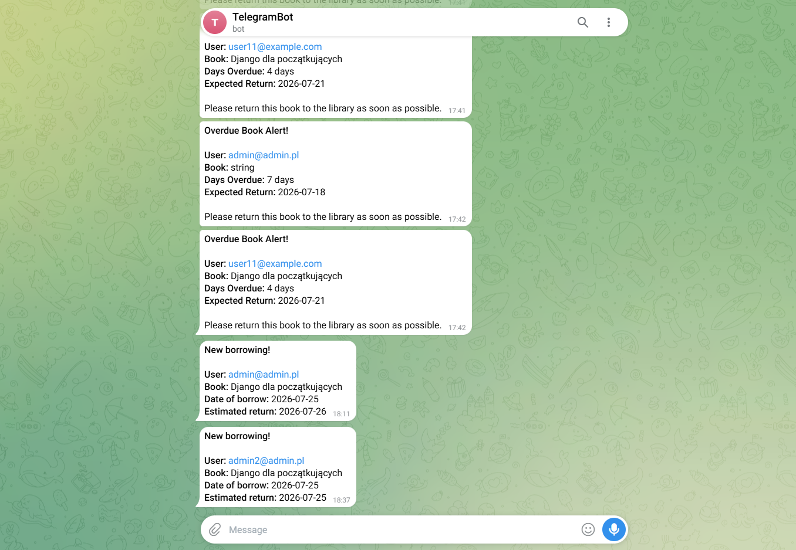

# Library Service API

RESTful API backend for managing a library system, built with Django, Django REST Framework, Celery, and Docker.

## 🚀 Technologies

* **Python 3.12+** / **Django** / **Django REST Framework (DRF)**
* **PostgreSQL** (Database)
* **Celery** & **Redis** (Background tasks & asynchronous notifications)
* **Stripe API** (Payment processing)
* **Telegram Bot API** (Automated notifications)
* **Docker** & **Docker Compose** (Containerization)

---

## 📋 Features

* **Books Management:** Inventory tracking and daily fee management.
* **Borrowings:** Create/return books, check active borrowings, automatically update inventory using database transactions, and handle late fee calculations.
* **Payments:** Stripe integration for handling payment sessions, webhooks, and success/cancel endpoints.
* **Notifications:** Automated Telegram alerts for overdue books via Celery periodic tasks.
* **Authentication & Users:** Token/Session auth, role-based permissions (Admin vs Regular User).
* **API Documentation:** Interactive Swagger/OpenAPI documentation via `drf-spectacular`.

---

## 🗄️ Database Schema


---

## ⚙️ Installation & Running Locally (Docker)

The easiest way to run the application is using Docker Compose.

1. **Clone the repository:**
   ```bash
   git clone <repository-url>
   cd py-library-service
   ```
   


## Create a `.env` file

Create a `.env` file in the root directory based on your configuration requirements (you can use .env.sample as a reference):

- Database credentials
- Stripe keys
- Telegram bot token

## Build and run containers

```bash
docker-compose up --build
```

## Run migrations and create a superuser

```bash
docker-compose exec web python manage.py migrate
docker-compose exec web python manage.py createsuperuser
```

The application will be available at:

- API: http://localhost:8000/

## To stop the containers, run:
```bash
docker-compose down
```

## 🧪 Running Tests

The project includes unit and integration tests covering models, serializers, views, custom commands, and utility tasks.

To run all tests inside Docker:

```bash
docker-compose exec web python manage.py test
```

To run tests for a specific app:

```bash
docker-compose exec web python manage.py test borrowings
docker-compose exec web python manage.py test core
docker-compose exec web python manage.py test notification
docker-compose exec web python manage.py test payment
```

## 📖 API Documentation

Once the server is running, you can access the interactive API documentation:

- **Swagger UI:** http://localhost:8000/api/doc/swagger/
- **ReDoc:** http://localhost:8000/api/doc/redoc/


---
##  Screenshots

### Swagger UI


### ReDoc


### Django Admin Panel


### Stripe Checkout Session


### Payment Success Endpoint (JSON Response)


### Telegram Notification


---


## 📋 API Endpoints

### 👤 Users (`/api/user/`)
| Method | Endpoint | Description |
|---|---|---|
| GET | `/api/user/users/` | List all users |
| POST | `/api/user/users/` | Register a new user |
| GET | `/api/user/users/{id}/` | Retrieve user details |
| PUT/PATCH | `/api/user/users/{id}/` | Update user profile |
| GET | `/api/user/users/me/` | Current user profile |
| PUT/PATCH | `/api/user/users/me/` | Update current user profile |

### 📚 Books (`/api/books/`)
| Method | Endpoint | Description |
|---|---|---|
| GET | `/api/books/` | List all books (Available to all) |
| POST | `/api/books/` | Create a new book (Admin only) |
| GET | `/api/books/{id}/` | Retrieve book details |
| PUT/PATCH | `/api/books/{id}/` | Update book (Admin only) |
| DELETE | `/api/books/{id}/` | Delete book (Admin only) |

### 📋 Borrowings (`/api/borrowings/`)
| Method | Endpoint | Description |
|---|---|---|
| GET | `/api/borrowings/` | List borrowings (Supports `?user_id=` filter for admins) |
| POST | `/api/borrowings/` | Create borrowing (decrements inventory, triggers Stripe & Telegram) |
| GET | `/api/borrowings/{id}/` | Retrieve borrowing details |
| POST | `/api/borrowings/{id}/return_book/` | Return a borrowed book |
| DELETE | `/api/borrowings/{id}/` | Delete borrowing |

### 💳 Payments (`/api/payments/`)
| Method | Endpoint | Description |
|---|---|---|
| GET | `/api/payments/` | List payments |
| GET | `/api/payments/{id}/` | Retrieve payment details (includes session data) |
| GET | `/api/payments/success/` | Stripe success callback (Public) |
| GET | `/api/payments/cancel/` | Stripe cancel callback (Public) |
| POST | `/api/payments/webhook/` | Stripe webhook listener (Public) |

### 🔔 Notifications (`/api/notifications/`)
| Method | Endpoint | Description |
|---|---|---|
| GET | `/api/notifications/` | List user's notifications (ReadOnly) |
| GET | `/api/notifications/{id}/` | Retrieve notification details |

### 📖 Documentation (`/api/doc/`)
| Method | Endpoint | Description |
|---|---|---|
| GET | `/api/doc/swagger/` | Interactive Swagger UI documentation |
| GET | `/api/doc/redoc/` | Redoc API documentation |


